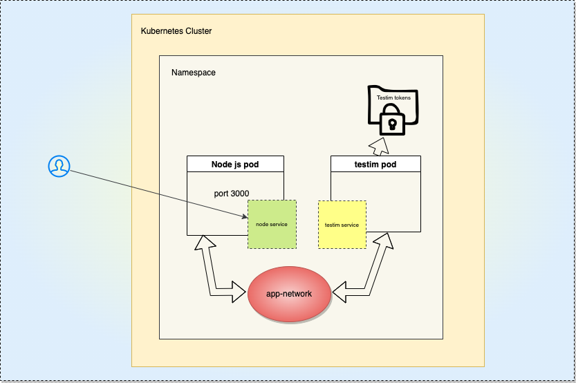

## **Testim integration with Nodejs sample app on docker to kubernetes cluster:** 

  

 

   *Disclaimer:  This Custom Action is provided "AS IS".  It is for instructional purposes only and is not officially supported by Testim*      

  - [**Setup Testim integration for local/grid CLI runs:**
](#setup-testim-integration-for-localgrid-cli-runsp)
  - [**Deploy & test in Kubernetes from CLI:**  
](#deploy--test-in-kubernetes-from-cli-brp)
  - [**Deploy & test in Kubernetes via Jenkins Pipeline:**  
](#deploy--test-in-kubernetes-via-jenkins-pipeline-brp)
  - [**Extras**](#extras)

 

###  **Setup Testim integration for local/grid CLI runs:**

* Run the following command within your node js application folder

        npm install --save @testim/testim-cli@latest

* Set testim-cli's dependency version as "latest" within package.json

* Set the testim parameters as applicble within scripts -> test section of package.json based on [docs](https://help.testim.io/docs/the-command-line-cli)

  

###  **Deploy & test in Kubernetes from CLI:**  
 

* Set Testim's token & project id within k8s/mysecret.yaml.

* cd into k8s folder.

* The following command will deploy k8s, run testim tests & perform cleanup: 
  
        chmod +x pipeline.sh && ./pipeline.sh

 

###  **Deploy & test in Kubernetes via Jenkins Pipeline:**  
 

* Set Testim's token & project id as password parameters

* Select pipeline script from SCM -> Git -> Jenkinsfile

 

###   **Extras**
 

* Follow [this](https://devopscube.com/jenkins-build-trigger-github-pull-request/) link to achieve automated build trigger on every github pull request.

* Follow [this](https://medium.com/bb-tutorials-and-thoughts/how-to-deploy-nodejs-apis-on-azure-aks-using-helm-8b37ab190d4e) to deploy NodeJS APIs on Azure AKS using HELM.

* Tool to convert docker-compose to k8s
https://kompose.io/ to convert docker-compose to k8s yamls: 

        kompose convert -f docker-compose.yaml

* Sample steps to build docker & publish to docker registry:

  * Create your Dockerfile and build docker:
      
          docker build -t nodejs .

  * Run container:

          docker run -d --name nodejs -p 3000:3000 nodejs

  * Login to docker and tag the existing docker image:

          docker tag nodejs genesisthomas/nodejs-starter:1.0

  * Upload the image to docker registry:

          docker push genesisthomas/nodejs-starter:1.0

